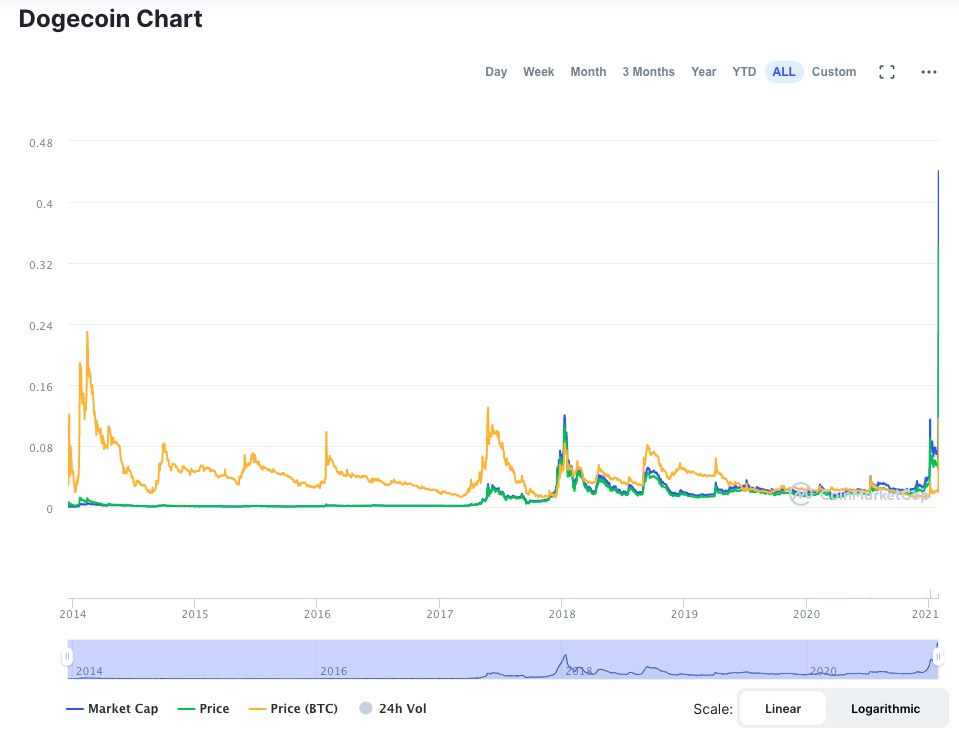

# 狗币，狗狗币，DogeCoin

Dogecoin，有人称作“狗狗币/狗币”，诞生于2013年12月8日，基于Scrypt算法，是国际上用户数仅次于比特币的第二大虚拟货币。

## 官方网站

### 官方网站
*  [Dogecoin](http://dogecoin.com/)

*  [GitHub](https://github.com/dogecoin/dogecoin)

*  [Getting Started](https://dogecoin.com/getting-started/)
 
## 交易平台

*  [币安交易平台](https://www.binance.com/en/register?ref=23297069) 全球最大的区块链交易平台
*  [OKEX](https://www.okexcn.com/join/1915102) 国内最早的交易平台之一。
*  [GateIO](https://www.gateio.io/ref/39856) 区块链最丰富的交易平台
*  [火币](https://www.huobi.be/topic/invited/?invite_code=fi483) 国内最早的交易平台之一。

## 发展历史

*  2013年12月8日诞生。
*  2017年6月，突破 0.003美元。
*  2018年1月，突破 0.02美元。
*  2020年1月，上涨超过 500%，突破 0.08美元。

## 历史行情

## 导航

GouBi.Net
